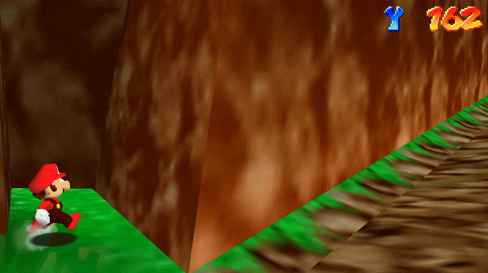
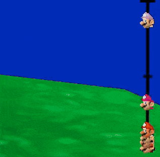
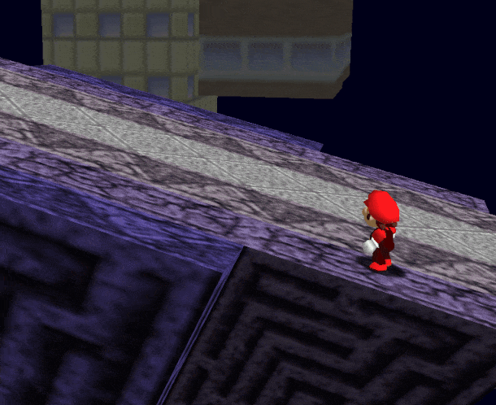
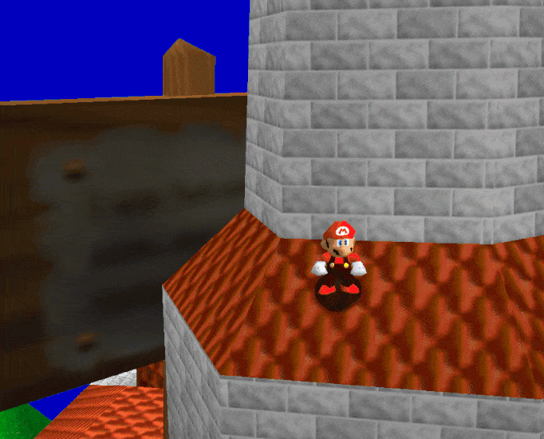
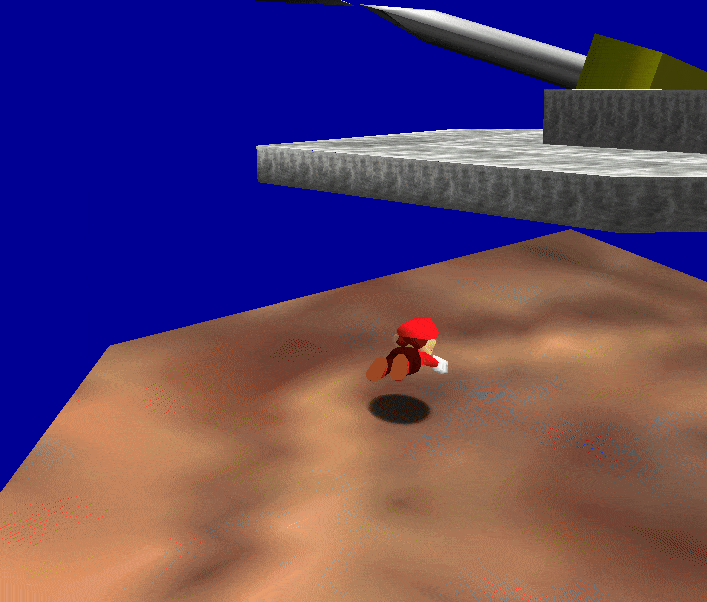
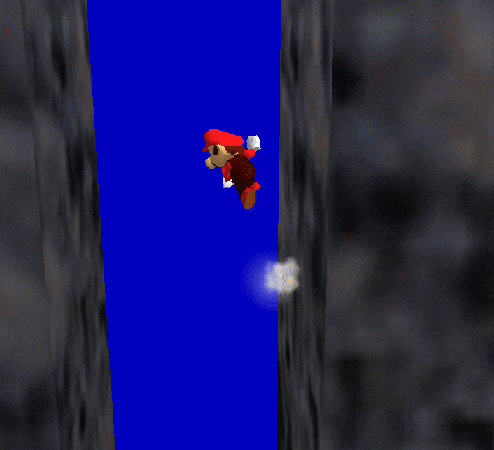
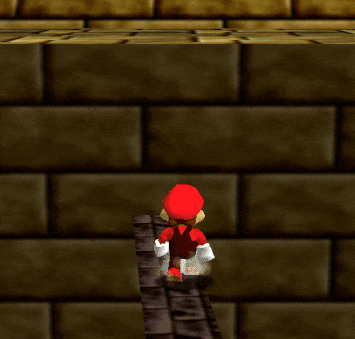
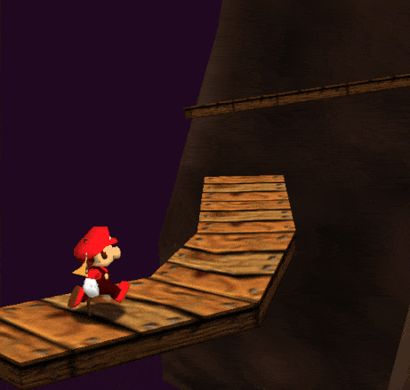
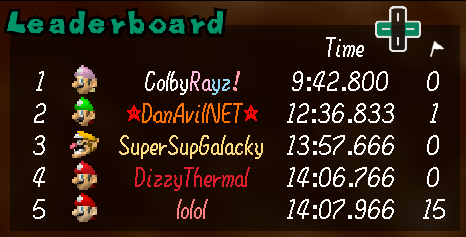
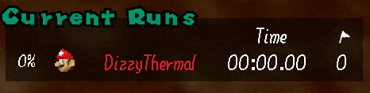

# Only Up 64 Plugin (sm64coopdx)

> [!NOTE]
> This mod is **NOT** the [Only Up 64 Map](https://github.com/DizzyThermal/sm64coopdx-only-up-64), download and install that first

## Plugin Features

### Practice Menu

<video style="display: block; margin: 0 auto;" controls muted autoplay loop>
  <source src="./resources/practice-menu.webm" type="video/webm">
</video>

> [!TIP]
> Enter the menu with the **`[L]`**` + `**`[R]`** keybind

> [!NOTE]
> Using the practice menu resets your current run time and checkpoints

---

### Character Height (Y-Coordinate) on HUD / Playerlist:

> [!TIP]
> Toggle character height in the settings menu (**`[L]`**` + `**`[R]`**)

---

### Character Height Meter on HUD:

> [!TIP]
> Toggle character height meter in the settings menu (**`[L]`**` + `**`[R]`**)

---

### Only Up 64 Moveset

> [!NOTE]
> This moveset is **NOT** 1:1 with Kaze's Only Up 64 ROM hack, however, PRs are always welcome to help improve it!

> [!TIP]
> Toggle Only Up 64 moveset in the settings menu (**`[L]`**` + `**`[R]`**)

---

#### Ground Pound Twirl (A, Z, A)

> [!NOTE]
> The rollout after twirl is to not allow consecutive ground pound twirls

---

#### Ground Pound Jump (A, Z, A on ground)

> [!NOTE]
> Triple front flip animation instead of jump twirl (like original ROM hack)

---

#### Ground Pound Dive (A, Z, B)

---

#### Wallslide

> [!NOTE]
> Also allows wallslide out of a long jump

---

#### Instant-Turn

> [!NOTE]
> Allows the player to make 180-degree (instant) turns when moving slow enough

---

### Checkpoint / Teleport System

> [!NOTE]
> Modified djoslin0's Checkpoints v2 plugin to work with the multiple areas of Only Up 64

> [!TIP]
> Toggle checkpoints in the settings menu (**`[L]`**` + `**`[R]`**)

---

### Leaderboard and Run Timer

> [!NOTE]
> View the official leaderboards online at [Dizzy's Abyss](https://dizzysabyss.com))

> [!TIP]
> Use the D-PAD to page through the entire leaderboard

> [!NOTE]
> Run timer tracks run time and checkpoints used and resets if the practice menu is used. 

> [!TIP]
> Toggle leaderboard and run timer in the settings menu (**`[L]`**` + `**`[R]`**)

---

## Changes

* Added Leaderboard and Run Timer
* Added / Refactored Chat Commands
* Added Checkpoints - modified to work in different areas (thanks djoslin0!)
* Added exportable server metrics
* Refactored a lot of the code
* Added Warp Menu for Practice
* Added Flood Mod Support
* Added Area 8 and made the plugin compatible with all versions of Only Up 64
* Added Debug Warp system from Only Up 64 Alpha testing to Only Up 64 Plugin (Default Off)
* Being able to change directions when ground pound diving
* Using the triple jump action for the ground pound jump (removed original ground pound jump)
* Sparkles on frame-perfect dive rollouts, wallkicks, and speed kicks.
* Less jank and higher gravity on the wall slide.
* Merging changes from the Only Up 64 Alpha Tests
* Decreased Ground Pound Twirl Y-Boost (42.0 -> 40.0)
* Decreased Ground Pound Twirl Count (20 -> 10)
* Allow Wallslide after Long Jump (Like Only Up 64)

## Known Issues

* Ground Pound Twirl ends in a `ACT_FORWARD_ROLLOUT` to make sure you cannot ground pound consecutively. This means Mario does a frontflip before entering free fall.

## Credits

* Moveset: `sm64ex-coop/extended-moveset.lua`, @steven3004
* Checkpoints: @djoslin0
* Recolored player heads: @EmilyEmmi
* sm64coopdx technical help: @cooliokid956, @andre8739
* Testing help: @colbyrayz.z64, @cooliokid956, @retrodarkgamerx
